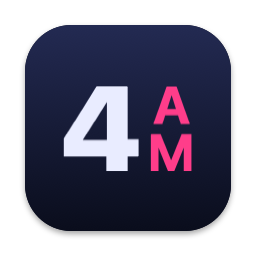
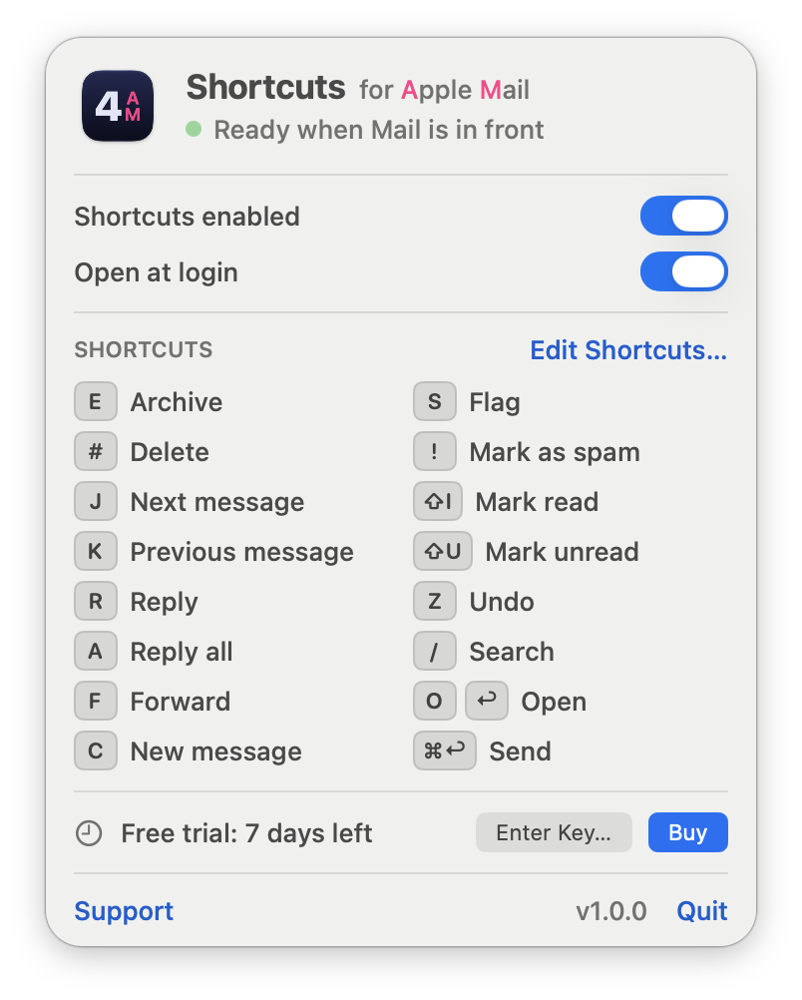

# 4AM for Apple Mail

**Keyboard shortcuts for Apple Mail on the Mac: Gmail, Outlook for Mac, Outlook for Windows, or your own.** Press `E` to archive, `J` and `K` to move through your inbox, `R` to reply, and `⌘↩` to send.

4AM is a small menu bar app that gives Apple Mail the shortcuts you already know. Pick Gmail's single keys, Outlook for Mac's shortcuts, or Outlook for Windows' Ctrl shortcuts (on the Mac's Control key), or set your own key for any action. Apple Mail's own shortcuts all need a modifier key, and the old Mail plug-ins that added Gmail keys no longer work on current macOS. 4AM is a separate app that needs no plug-in.

**[Download the free trial](https://caninodigital.com/4am/4AM.dmg)** · **[Product page](https://caninodigital.com/4am/)** · **[Buy a license (USD$9.99)](https://caninodigital.lemonsqueezy.com/checkout/buy/dadbaa88-5737-48e0-9b0e-56587e397f38)**

## Shortcut sets

Choose a set from the 4AM menu and switch any time.

| Set | What you get | Full list |
|---|---|---|
| **Gmail** | Single keys: `E` archive, `J` / `K` next and previous, `R` reply, `#` delete | [Gmail shortcuts for Apple Mail](https://caninodigital.com/4am/gmail-shortcuts-for-apple-mail/) |
| **Outlook for Mac** | The keys Mail does differently: `⌃E` archive, `⌘J` forward, `⌘T` mark as read, `⌃1` flag | [Outlook for Mac shortcuts for Apple Mail](https://caninodigital.com/4am/outlook-for-mac-shortcuts-for-apple-mail/) |
| **Outlook for Windows** | Ctrl shortcuts on the Control key: `⌃R` reply, `⌃F` forward, `⌃N` new, `⌃↩` send, `⌃C` / `⌃V` / `⌃X` copy, paste and cut | [Outlook for Windows shortcuts for Apple Mail](https://caninodigital.com/4am/outlook-for-windows-shortcuts-for-apple-mail/) |
| **Custom** | Your own keys. Start from any set, click an action in the 4AM menu and press the key you want | |
| **Off** | 4AM steps aside and Apple Mail's own shortcuts apply | |

### The Gmail set

| Key | Action | Key | Action |
|---|---|---|---|
| `E` | Archive | `S` | Flag |
| `#` | Delete | `!` | Mark as spam |
| `J` | Next message | `⇧I` | Mark read |
| `K` | Previous message | `⇧U` | Mark unread |
| `R` | Reply | `Z` | Undo |
| `A` | Reply all | `/` | Search |
| `F` | Forward | `O` or `↩` | Open message |
| `C` | New message | `⌘↩` | Send (in a compose window) |

Single keys work in the message list and in a message opened in its own window. The 4AM menu lists every shortcut in the set you've chosen and shows where each one works.

### Choosing your own keys

Click **Edit Shortcuts…** in the 4AM menu, click an action and press the key you want. A few rules keep this safe:

- Send, Copy, Paste and Cut work while you're typing, so they need `⌘`, `⌃` or `⌥` held down.
- `⌘Q`, `⌘W`, `⌘H` and `⌘M` belong to macOS and can't be reassigned. Escape and Tab can't be shortcuts.
- A key belongs to one action at a time. Giving it to another action moves it.

## Install

1. Download [4AM.dmg](https://caninodigital.com/4am/4AM.dmg), open it and drag 4AM into Applications. Open 4AM.
2. macOS asks to let 4AM control your Mac. Choose **Open System Settings** and switch 4AM on. If it isn't in the list, add it with the **+** button.
3. In Mail, select a message and press a key. Click the 4AM icon in the menu bar to see every shortcut.

Requires **macOS 27 or later**. The download is signed and notarised by Apple.

## Privacy

An app that listens for keys has to earn trust, so here is exactly what 4AM does:

- **It never records what you type.** Each key is checked against your shortcut list and forgotten. Nothing is logged or stored.
- **It only looks at the keyboard while Mail is in front.** Switch to another app and it stops entirely.
- **Typing is never touched.** Plain keys such as `E` fire only when a message or the message list is selected. In a message you're writing, only shortcuts held with `⌘`, `⌃` or `⌥` act (such as `⌘↩` to send, or `⌃C` in the Outlook for Windows set). Searching and Spotlight work as normal.
- **What happens while you write an email.** 4AM still sees each key press in a compose window, because that is the only way it can notice a shortcut such as `⌘↩` to send. It compares the key with your shortcut list, finds no match and passes it to Mail unchanged. It keeps no copy: nothing you type is saved to memory, to disk or to a log, and nothing is sent anywhere.
- **One network connection, when you ask.** 4AM contacts the internet only when you activate or deactivate a license key, sending that key and your Mac's name. Nothing about your mail is ever sent.

## What 4AM needs access to

| Access | Why | What it doesn't do |
|---|---|---|
| **Accessibility** (required) | To see which part of Mail is selected, notice shortcut keys while Mail is in front, and press Mail's own menu commands, such as Archive, for you. | It doesn't read the content of your emails. It looks at what kind of element is selected (for example "the message list"), not what's in it. It does read the names of Mail's menu items, which is how it finds commands such as Archive. |
| **Input Monitoring** (only if macOS asks) | On some setups macOS wants this as well before an app can notice key presses. 4AM asks only if it's needed on your Mac. | Same as above: keys are checked against your shortcut list and forgotten. |
| **Internet** (only when you activate) | To confirm a license key with Lemon Squeezy, sending the key and your Mac's name. | No analytics, no tracking, no update checks, and nothing about your mail. |
| **Keychain** | To store your license key and the date your trial started. The trial date is kept there on purpose so that deleting and reinstalling the app doesn't restart the trial; it stays until you remove it (see below). | It doesn't read any of your other Keychain items. |
| **Open at login** (optional) | So 4AM starts with your Mac. It asks once; you can change it any time. | |

### What Canino Digital can see

- **When you buy:** the name and email address you give at checkout, through Lemon Squeezy, which processes the payment. Card details go to Lemon Squeezy and are never seen by Canino Digital.
- **When you activate:** the name of the Mac, such as "Sam's MacBook Air", listed against your license key so you can tell your activations apart.
- **Nothing else.** 4AM has no analytics and sends no usage data, so there is no record of how, when or whether you use it.

### Files and debugging tools

4AM keeps these on your Mac:

- `~/Library/Application Support/4AM/custom.json`: your Custom shortcut set, once you've made one.
- `~/Library/Application Support/4AM/keymap.json`: advanced settings, such as the names of Mail's menu commands.
- `~/Library/Preferences/com.caninodigital.4AM.plist`: whether shortcuts are switched on, and similar settings.
- `~/Library/Logs/4AM/debug.log`: written only when you use the debugging tools.

The debugging tools appear when you hold Option and click the menu bar icon. They exist to diagnose problems after a macOS update. They record which shortcut ran and the kind of element selected in Mail, never the keys you press or any text. One tool, "Log Menu Structure", writes the names of Mail's menus to that log, which can include your mailbox names. The log stays on your Mac and is never sent anywhere; you choose whether to share it when reporting a problem.

### Removing 4AM completely

1. Quit 4AM and delete it from Applications.
2. Remove it under System Settings › Privacy & Security (Accessibility, and Input Monitoring if listed) and under General › Login Items.
3. Delete the files listed above.
4. In the Keychain Access app, search for `com.caninodigital.4AM.license` and delete the entries. These hold your license key and trial date.

## Pricing

Free for 7 days with everything working. After that, a one-time purchase of USD$9.99 unlocks it. No subscription. A license key works on up to 3 Macs and can be moved by choosing **Deactivate on This Mac**.

## Questions

**Can Apple Mail use Gmail keyboard shortcuts?**
Not by itself. 4AM adds them.

**Can Apple Mail use Outlook keyboard shortcuts?**
Not by itself. 4AM has an Outlook for Mac set and an Outlook for Windows set.

**How do I use Ctrl+C and Ctrl+V in Apple Mail?**
Choose 4AM's Outlook for Windows set. Control-C, Control-V and Control-X then copy, paste and cut in Mail. See the [guide](https://caninodigital.com/4am/ctrl-c-ctrl-v-in-apple-mail/).

**How do I archive in Apple Mail with one key?**
With 4AM, select a message and press `E`. Without it, Mail's archive shortcut is Control-Command-A.

**Does it work with Gmail, iCloud and Outlook accounts?**
4AM works with Apple Mail itself, so it should work with any account you've added to Mail. Try the free trial to check it with yours.

**Will it keep working after macOS updates?**
4AM is tested on macOS 27 with Mail 16. It relies on parts of macOS that Apple can change at any time, so compatibility with future macOS versions isn't guaranteed. Fixes are released when possible.

## Support

- **Found a bug or have a request?** [Open an issue](../../issues).
- **Anything else:** 4am@caninodigital.com

## About this repository

This repository holds 4AM's documentation, release notes and issue tracker. 4AM is not open source and its source code is not published here.

4AM is made by [Canino Digital](https://caninodigital.com/). It is an independent app and is not affiliated with or endorsed by Apple, Google or Microsoft. Apple Mail and macOS are trademarks of Apple Inc. Gmail is a trademark of Google LLC. Outlook and Windows are trademarks of Microsoft Corporation.

© 2026 John Canino. All rights reserved.
